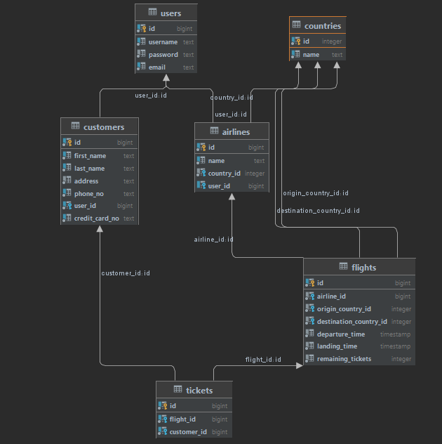

## delete tables with this orders for cascade delete
- tickets
- flight
- airlines
- customers
- users
- countries

## insert data with the the opposite order for cascade insert
- countries
- users
- customers
- airlines
- flights
- tickets

## diagram 

# !!!using pg module on node with pool.quary not get async await as expected:
- i used transactions for get the current results.
- secound solution: using knex module with raw method.

